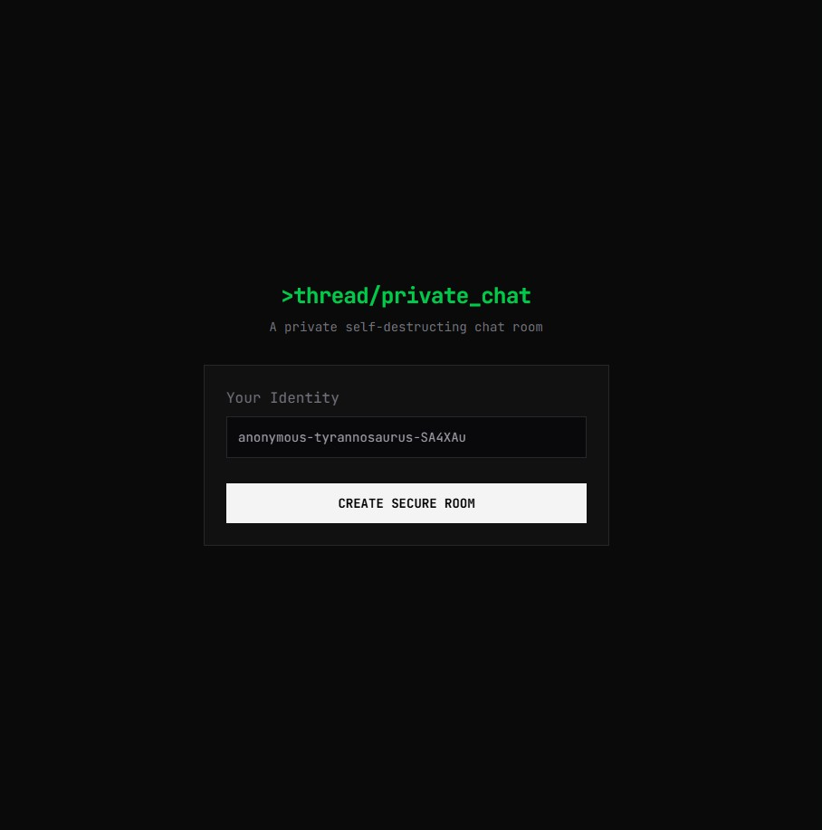
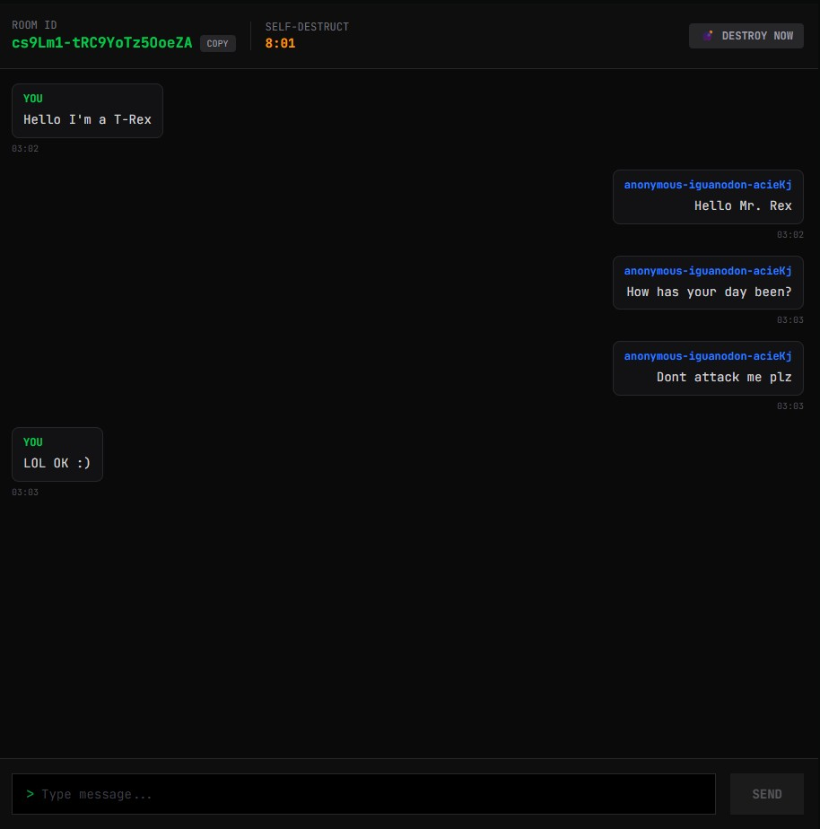

Thread is a lightweight, self-destructing chat room app built with Next.js, ElysiaJS, and TanStack Query.

## Getting Started

First, run the development server:

```bash
npm run dev
# or
yarn dev
# or
pnpm dev
# or
bun dev
```

Open http://localhost:3000 with your browser to see the result.

You can start editing the page by modifying `src/app/page.tsx`. The page auto-updates as you edit the file.

This project uses `next/font` to optimize and load fonts automatically.

## Features

- Ephemeral rooms with a self-destruct timer
- Room capacity limits and auth via `x-auth-token`
- Realtime message updates
- Messages are stored in Redis
- Rooms expire after 10 minutes

## Screenshots



